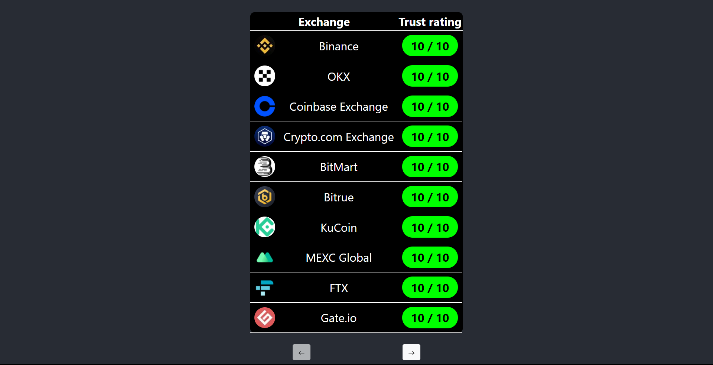
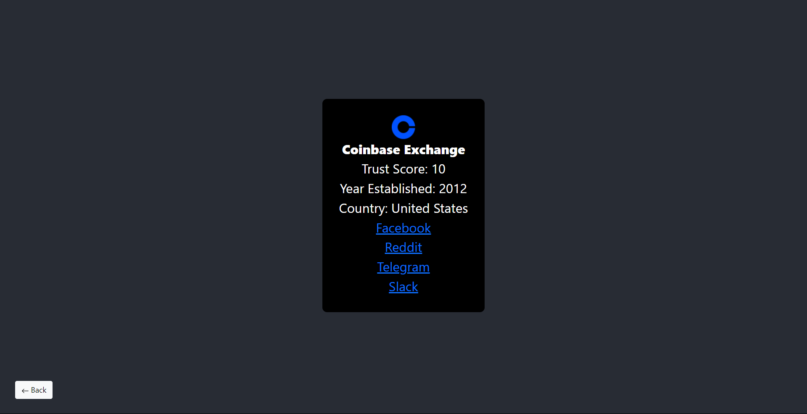

# Exchange Directory using CoinGecko API

## Building and running the project

```
git clone https://github.com/oschleic/ExchangeDirectory/
cd ExchangeDirectory
npm i
npm start
```

## Homepage



## Exchange page


